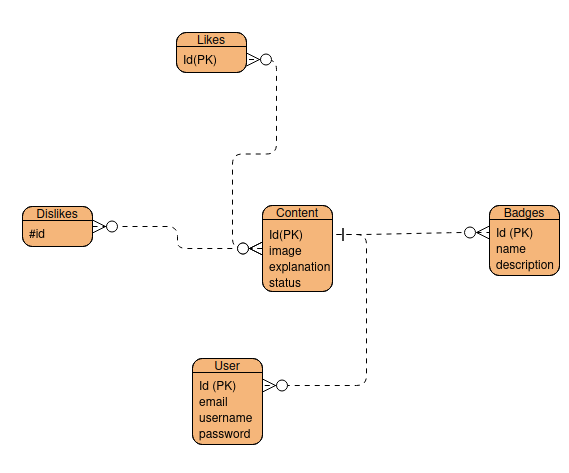

# WikiAuto

Gain knowledge about the indications we used to see on the road and also some helpful advice that can help us deal with problems on the road. As a developer learning how to drive a car at a Driving school and Nuxtjs, I thought about making this project to help me memorize what I'm learning and also have a place to revise in case. While learning, I discovered this knowledge is useful for those who drive a car, the passengers, and everyone else.

## Tech used

- [Nuxtjs](https://nuxt.com/)
- [Supabase](https://supabase.com/docs)

## Kind of specifications

We will have just one known user in this app.

### Admin

This user will be responsible for filling the app with content and his main tasks will be:

- Login to his account
- Create badges (e.g.: signalization, fire, etc.)
- Accepting propositions of content
- Refusing content propositions
- Creating/deleting a group
- Adding/removing a content to a group

### Anonymous user

These users are those who propose content anonymously but they can also add their email, name, and profile image if they want it to be displayed on the content. There is no restriction on them. They will:

- Proposing a content
- Like/dislike a content
- Commenting a content
- Received an email when their content is approved or rejected (If their email is provided)
- (Maybe) create a draft content (must provide an email to identify them when they will come back to edit)
- Create a badge dynamically when not listed in the proposition list
- See all the content accepted
- Filter content by group, name, most liked or disliked

### Other features

- A rejected content will be automatically deleted if not updated two days later.
- If content reaches a certain number of dislikes, it will be deleted

### ERD proposition



### Make before use

First you need to install the dependencies
```bash
bun install
```

Open the pre-commit script
```bash
nano .git/hooks/pre-commit
```

and then add the script after installation
```bash
#!/bin/sh
FILES=$(git diff --cached --name-only --diff-filter=ACMR | sed 's| |\\ |g')
[ -z "$FILES" ] && exit 0

# Prettify all selected files
echo "$FILES" | xargs ./node_modules/.bin/lint-staged --allow-empty

# Add back the modified/prettified files to staging
echo "$FILES" | xargs git add

exit 0
```

Se also the script for the `pre-push`
```bash
nano .git/hooks/pre-push
```

And then add this script:
```bash
#!/bin/sh
bun run test:coverage
```

Finally make the file executable:
```bash
# pre-push
chmod 700 .git/hooks/pre-push

# pre-commit
chmod 700 .git/hooks/pre-commit
```
